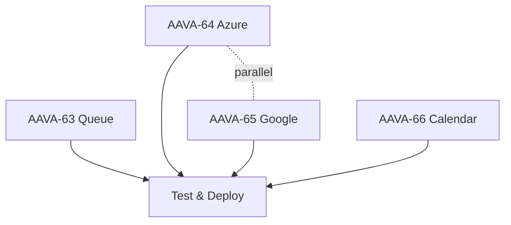

# Linear Issues - Community Requested Features

**Project**: Asterisk AI Voice Agent  
**Created**: November 12, 2025  
**Ordered By**: Complexity (Low → High)

This document contains detailed specifications for Linear issues tracking community-requested features for v4.2.

---

## AAVA-63: Transfer to Queue Tool ⭐ EASY

**Priority**: P0 | **Est**: 2-3 days | **Complexity**: 2/10

### Summary
Implement ACD queue transfer tool allowing AI agents to transfer callers to Asterisk queues for agent pickup.

### Details
**Files**: `src/tools/telephony/queue_transfer.py` (~300 lines), tests (~20)  
**Config**: Add queue mappings to `tools.transfer_to_queue.queues`  
**API**: Asterisk ARI Queue Operations  
**Docs**: https://wiki.asterisk.org/wiki/display/AST/Asterisk+18+Queues+REST+API

### Implementation
Tool resolves queue names (sales, support) to Asterisk queues, checks status, transfers caller, and returns position/wait time.

### Acceptance Criteria
- Queue name resolution works
- Caller transferred successfully
- Position announced
- Error handling (not found, full)
- 20 unit tests passing

---

## AAVA-64: Azure Speech Provider ⭐⭐ MODERATE

**Priority**: P1 | **Est**: 4-6 days | **Complexity**: 4/10

### Summary
Integrate Microsoft Azure Speech Services for enterprise STT/TTS with Neural voices.

### Details
**Files**: `src/providers/azure_speech.py` (~800 lines), tests (~30)  
**Dependencies**: `azure-cognitiveservices-speech==1.40.0`  
**Env**: `AZURE_SPEECH_KEY`, `AZURE_SPEECH_REGION`  
**Docs**: https://learn.microsoft.com/en-us/azure/ai-services/speech-service/

### Implementation
Push stream for real-time audio, event handlers for partial/final transcripts, SSML for TTS, audio format conversion.

### Acceptance Criteria
- STT streaming works
- TTS Neural voices functional
- SSML controls working
- 30 unit tests passing
- Setup documentation complete

---

## AAVA-65: Google Cloud Speech Provider ⭐⭐ MODERATE

**Priority**: P1 | **Est**: 4-6 days | **Complexity**: 4/10

### Summary
Integrate Google Cloud Speech-to-Text and Text-to-Speech for GCP ecosystem.

### Details
**Files**: `src/providers/google_speech.py` (~850 lines), tests (~30)  
**Dependencies**: `google-cloud-speech==2.27.0`, `google-cloud-texttospeech==2.17.2`  
**Env**: `GOOGLE_APPLICATION_CREDENTIALS`, `GOOGLE_CLOUD_PROJECT`  
**Docs**: https://cloud.google.com/speech-to-text/v2/docs

### Implementation
gRPC streaming with audio queue, telephony model for STT, Neural2 voices for TTS, service account auth.

### Acceptance Criteria
- gRPC streaming reliable
- Telephony model working
- Neural2 TTS quality excellent
- 30 unit tests passing
- GCP setup guide complete

---

## AAVA-66: Calendar Appointment Tool ⭐⭐⭐ COMPLEX

**Priority**: P2 | **Est**: 6-8 days | **Complexity**: 6/10

### Summary
Implement calendar appointment booking with availability checking for Google Calendar/Outlook.

### Details
**Files**: `src/tools/business/calendar_appointment.py` (~600 lines), calendar client (~400), datetime parser (~200), tests (~80 total)  
**Dependencies**: `google-api-python-client==2.147.0`, `python-dateutil==2.9.0`  
**APIs**: Google Calendar API, MS Graph API  
**Docs**: https://developers.google.com/calendar/api

### Implementation
Natural language date parsing, free/busy API calls, conflict detection, OAuth2 auth, email confirmations, timezone handling.

### Acceptance Criteria
- Date NLP works ("tomorrow at 2pm")
- Availability checking accurate
- Double-booking prevented
- Timezone conversions correct
- OAuth2 setup documented
- 80 unit tests passing

---

## Dependencies & Order

**Recommended Order**: AAVA-63 → AAVA-64 || AAVA-65 → AAVA-66

## Total Estimate
**Sequential**: 18-23 days  
**Parallel (Azure+Google)**: 14-19 days
